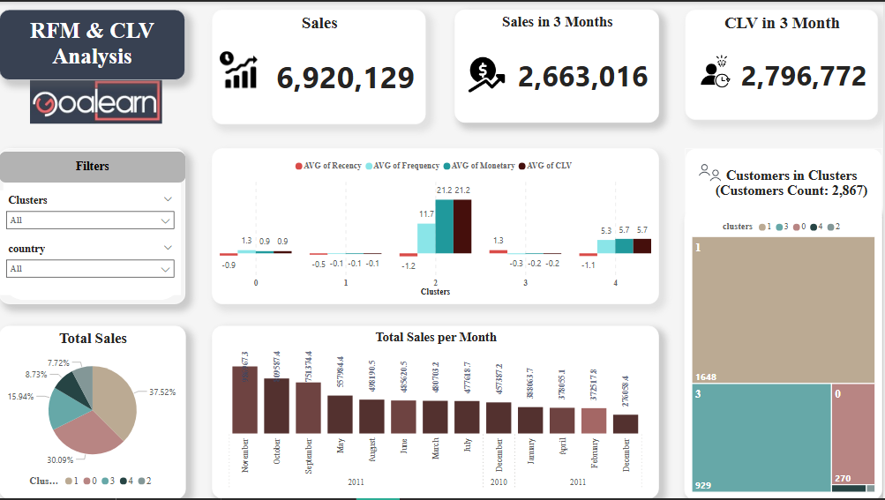
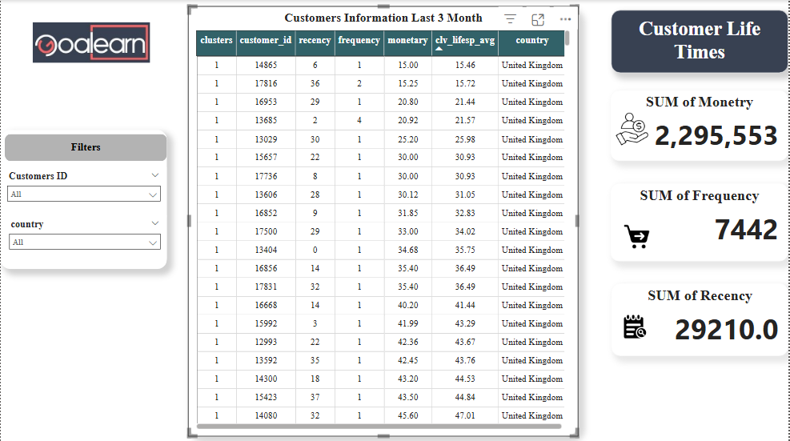

<<<<<<< HEAD
# rfm-clv-dashboard
=======
# 📊 Customer Segmentation & CLV Analysis

## 🚀 Project Highlights
- 📈 **RFM Analysis** – Segmentation of customers based on **Recency**, **Frequency**, and **Monetary value**.  
- 💰 **Customer Lifetime Value (CLV) Estimation** – Measuring the potential value of each customer over time.  
- 🖥️ **Interactive Dashboard (Power BI)**  
  - **📌 Treemap** → Number of clusters & customer counts (quarterly).
  - **📊 Clustered Column Chart** → RFM metrics & CLV per cluster  
  - **🔎 Column Chart** → Total monthly sales trends.
  - **Pie Chart** → Sales contribution by cluster.
  - **Slicers** → Filter by *Cluster* and *Country*.


---

## 📊 Dashboard Preview




---

## 📌 Cluster Insightsٰ

| Cluster | Emoji | Features | CLV | Analysis |
|---------|-------|----------|-----|---------|
| 0 | 🔴 | High Recency (not purchased recently), very low Frequency & Monetary | Very low | Almost lost customers; need reactivation campaigns |
| 1 | 🟡 | Medium Recency, low Frequency & Monetary | Low | Still active but generate limited value |
| 2 | 🟢 | Very low Recency (recent purchase), very high Frequency & Monetary | 21.2 | Most valuable customers |
| 3 | 🔵 | Medium Recency & Frequency | 0.8 | Potential to become Potential/VIP customers |
| 4 | 🟣 | Low Recency, Frequency higher than regular, Monetary medium | 5.7 | On the verge of becoming VIP; growth possible with marketing campaigns |

> 💡 **Note:** The table provides a quick visual overview of cluster characteristics and their CLV.

---

## 📝 Managerial Summary

- **🎯 Customer Segmentation:** Differentiates churned, regular, potential, and VIP customers  
- **💡 Retention Focus:** Churned customers (Cluster 0) require reactivation campaigns  
- **📈 Growth Opportunities:** Potential (Cluster 4) and Average (Cluster 3) customers can be nurtured to VIP  
- **💎 High-Value Customers:** VIP customers (Cluster 2) are the primary source of revenue and long-term business value  
- **📊 Data-Driven Decisions:** Power BI dashboard enables trend monitoring and detailed cluster analysis  

---


## 📂 Project Structure

```text
rfm-clv-dashboard/
├── notebooks/       # Jupyter Notebooks (RFM, CLV calculations, data cleaning)
├── data/            # OnlineRetail.xlsx
├── assets/          # Dashboard screenshots
├── powerbi/         # Power BI (RFM_CLV_dashboard.pbix) file
├── README.md        # Project documentation
├── .gitignore       # Ignore unnecessary files
└── LICENSE          # MIT License
```

---

## 📂 Dataset
- **Source:** Internal sales and transaction data  
- **Preprocessing:** Data cleaning and RFM & CLV calculation performed before normalization and clustering  

---

## 🛠️ Tech Stack
- **Python**: Pandas, NumPy, Matplotlib  
- **Power BI**: Interactive dashboarding & visualization  
- **Git/GitHub**: Version control & project sharing  

---

## ⚙️ How to Use
1. Clone the repository:
```bash
git clone  https://github.com/FarnazOmidvari/rfm-clv-dashboard
```

2. Open the Power BI dashboard (RFM_CLV_dashboard.pbix file) in Power BI Desktop to explore the dashboard interactively.
3. Open the Jupyter Notebooks in notebooks/ for data processing.
4. Replace data/OnlineRetail.xlsx with your own dataset (if available).


---

🚧 Future Improvements

🔹 Deploy dashboard online (Power BI Service / Streamlit).

🔹 Add predictive models for churn & CLV forecasting.

🔹 Automate ETL pipeline with Airflow.

---

📜 License

This project is licensed under the MIT License – see the LICENSE
 file for details.

👤 Author

Farnaz Omidvari

📧 farnaz.omidvari1983@gmail.com

💼 https://www.linkedin.com/in/farnazomidvari/

>>>>>>> 7ea8886 (Initial commit - RFM CLV Dashboard project)
